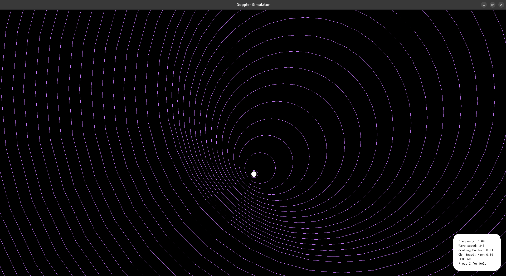
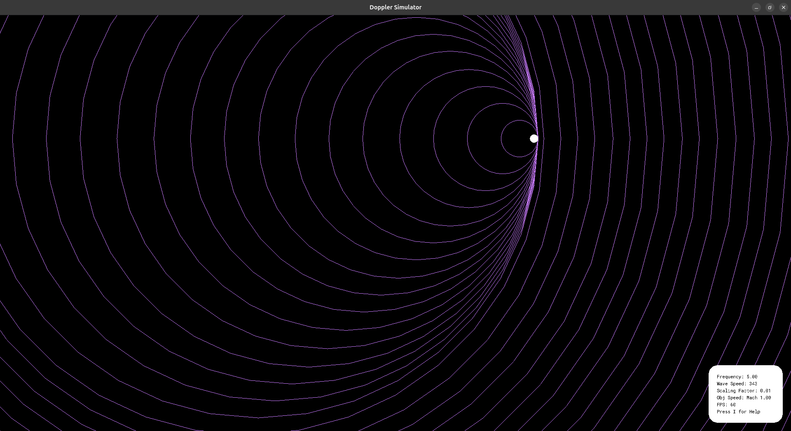
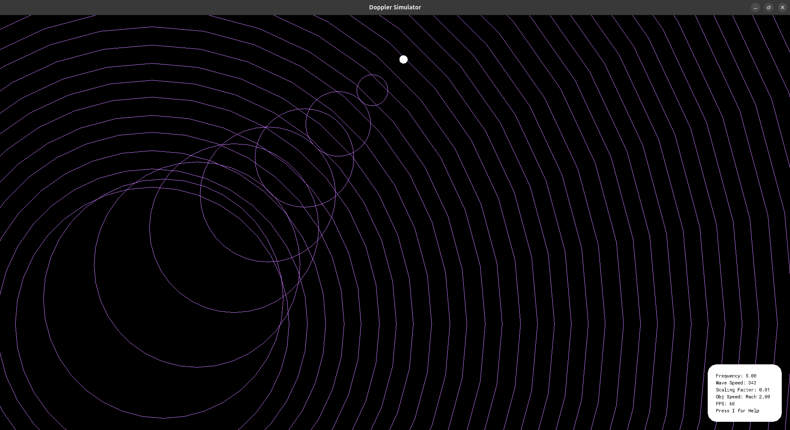

# Doppler Simulator

a simple, light-weight Doppler Effect Visualiser built using C89 and "Raylib".

## Snapshots:

### Mach 0.5

### Mach 1.0

### Mach 2.0

### Build

    gcc doppler.c -o doppler -lraylib